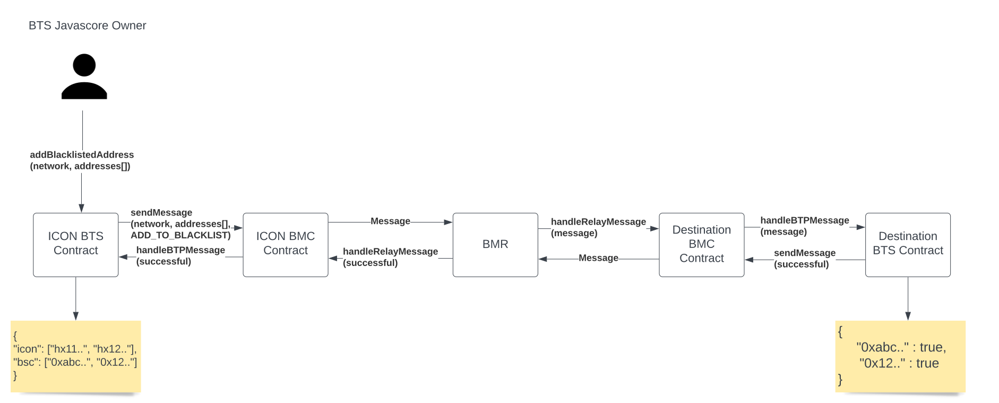

# Blacklist Design 

## Introduction
This document describes the design for maintaining the blacklist for ICON Bridge. This design presents design to implement the blacklist details in the BTP Token Service (BTS) Contract and cross chain message transfer when a user is blacklisted for a network.

## Terminologies
| Term | Definition                  | Link |
|:-----|:----------------------------|:-----|
| BTS  | BTP Token Service Contract  |      |
| BMC  | BTP Message Center Contract |      |


## Considerations
Blacklist is maintained on the ICON Javascore. This blacklist message is transmitted to other specific chains, when a user is added or removed from the blacklist.

## Design
The information of blacklist will be maintained by the service handler itself so that some addresses can be blacklisted from using that service. The BTS javascore of ICON acts as the parent contract for blacklisting users from using BTS Service.

### Blacklist Flow
- When a user is to be blacklisted on ICON, this is maintained on ICON BTS Contract only. No cross chain message is needed.
- When a user is to be blacklisted on other chains, this transaction will be originated on ICON BTS itself. Then, a BTP Message will be sent to destination chain. The destination chain picks up the blacklist message, and blacklists users on destination chain. After this operation, the BTS of destination sends BTP Message back to ICON BTS and icon acknowledges it.
- The same flow is followed when user is removed from blacklist.

### Data Structure
- ICON maintains blacklist of all the addresses blacklisted on all supported networks.
- Other supported chains just need to check if given address of that chain is blacklisted. So, 1 level mapping/hashmap is enough.


When a user with address  is to be added to blacklist for network/chain , owner, calls a method  on the  contract

```py
def addBlackListedUser(str net, str[] address):
    ownerCheck()
    checkSupportedNetwork(net)
    blacklist[net][address] = True
    sendBTPMessage(net, address, BLACKLIST_MESSAGE:ADD_TO_BLACKLIST)
```

This message goes through and is picked up by relay. The relay picks up  message coming from  and forwards the message to the required destination chain. The  contract in the destination chain will maintain a blacklist based on this message. This information will be used to check restrictions across supported chains. 

The destination chain has to check a condition if the incoming request is token transfer or blacklist or any other service type. If the request is `ADD_TO_BLACKLIST` service type of `BLACKLIST_MESSAGE` then the addresses needs to be added to blacklist.  This is implemented on the `handleBTPMessage` method of the [BTS Periphery](/solidity/bts/contracts/BTSPeriphery.sol) contract. 

If this is successful, it sends BTP Message back to ICON representing successful addition to blacklist and ICON BTS acknowledges it. If not successful, it again sends BTP Message back to ICON, and ICON removes that address from blacklist on ICON side for consistency. This is implemented on the `handleBTPMessage` method of the [BTS Javascore](/javascore/bts/src/main/java/foundation/icon/btp/bts/BTPTokenService.java) contract. 



fig: Cross Chain Blacklist 

The process for removing users from blacklist is same. For removing addresses from blacklist on ICON, no cross chain message is required, but it's required for other chains.

```py
def removeBlackListedUser(str net, str[] address):
    ownerCheck()
    checkSupportedNetwork(net)
    verifyUserIsBlacklisted(net, address)
    blacklist[net][address] = False
    sendBTPMessage(net, address, BLACKLIST_MESSAGE:REMOVE_FROM_BLACKLIST)
```

The destination chain has to check a condition if the request is `REMOVE_FROM_BLACKLIST` service type of `BLACKLIST_MESSAGE` then the addresses needs to be removed from blacklist.  This is again implemented on the `handleBTPMessage` method of the [BTS Periphery](/solidity/bts/contracts/BTSPeriphery.sol) contract. 

Again, the response is handled on ICON BTS as well similar to add to blacklist.

## Application
Blacklist is checked on every cross chain token transfer operation. ICON BTS checks if user is blacklisted on source as well as destination, whereas other chain only checks if the address is blacklisted on BTS of that chain.


## Implementation
1. [ICON BTS](/javascore/bts/src/main/java/foundation/icon/btp/bts/BTPTokenService.java) 
2. [Solidity BTS](/solidity/bts/contracts/BTSPeriphery.sol)