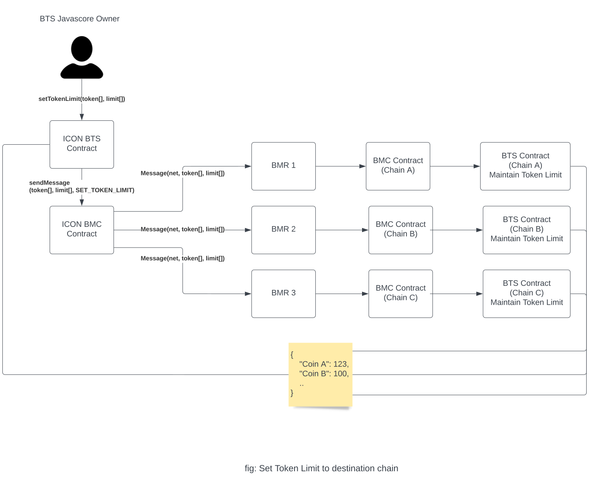
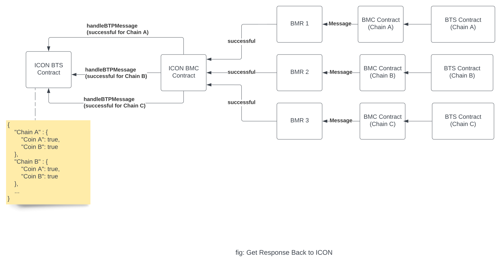

# Token Limit Design

## Introduction
This document describes the design implementing a token limit for token transfers across chains. This document  includes design to implement token limit in the BTS java contract and message cross chain about the token that was registered and limit for the registered token.

## Terminologies
| Term | Definition                  | Link |
|:-----|:----------------------------|:-----|
| BTS  | BTP Token Service Contract  |      |
| BMC  | BTP Message Center Contract |      |
| BMR  | BTP Message Relay           |      |


## Considerations
Token Limit is maintained on the ICON BTS Javascore. When a token limit is registered, the javascore forwards event logs including data of all the supported chains to the relayer which later will be picked up by all supported chains. 

## Design

### Token Limit Flow
- When a token limit is to be set for a coin, this transaction will be originated on ICON BTS itself. Then, a BTP Message will be sent to all connected chains. The destination chain picks up the token limit message, and sets token limit for token on destination chain. After this operation, the BTS of destination sends BTP Message back to ICON BTS and ICON acknowledges it.

### Data Structure
- 1 level mapping/hashmap is enough, with coinname as key, and tokenLimit as it's value.


Token limit can be transmitted across chains just like blacklist message. After a token is registered, and if token limit is to be set on it, a method `setTokenLimit` is called by BTS Owner. The limit will be set on ICON and sends a BTP Message is generated. This message about the token and limit will be sent to all the connected chains for them to maintain token limit as well. This message picked up by BMR and will call `handleRelayMessage` of destination BMC which in turn calls `handleBTPMessage` of the destination BTS, which accepts the token limit message, sets token limit on the destination BTS, and sends a response back to ICON whether it was successful.

```py
def setTokenLimit(str[] coins, int[] limits):
    checkOwner()
    require(len(coins) == len(limits))
    for i in range(len(coins)):
        tokenLimit[coins[i]] = limits[i]
    for net in supportedNetworks:
        sendBTPMessage(net, coins, limits, CHANGE_TOKEN_LIMIT)
```





ICON keeps track if the token limit has been set on all chains based on the response. If it failed on any chain, token limit can be set again on that chain, by using the above process.

ICON contract maintain lists of all the supported chains. Eventlog will be generated for each chain, meaning if ICON Bridge supports n number of chains, n messages containing information of (tokenName, limit, chain) will be generated for relay to pick up, and token limit message will be handled on all connected chains.

Token Limit can be set for tokens that not registered yet.

## Application
Token Limit is checked on every cross chain token transfer operation. The amount to transfer cross chain is checked against token limit, and if greater, the txn is reverted.

## Implementation
1. [ICON BTS](/javascore/bts/src/main/java/foundation/icon/btp/bts/BTPTokenService.java) 
2. [Solidity BTS](/solidity/bts/contracts/BTSPeriphery.sol)