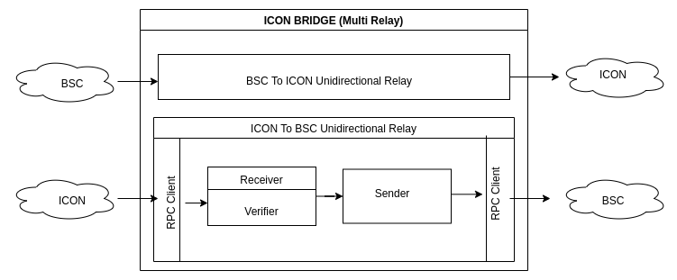
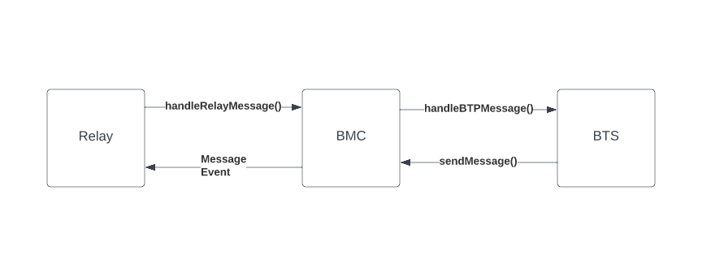

 # Architecture 
- [Protocol Architecture](#protocol-architecture)
- [Relay Architecture](#relay-architecture)
- [Contracts Architecture](#contracts-architecture)

 ## Protocol Architecture

 The purpose of BTP is to enable complex cross-chain applications with smart contracts residing on two or more blockchain networks with as few security sacrifices as possible. BTP 1.0 does this with a centralized bridge that relays BTP messages between multiple chains. Message verifiers are implemented per chain on the relay itself. This has the benefit of imposing lesser gas cost compared to on-chain verifiers while also verifying the integrity of the transmitted BTP message. However, having a centralized bridge itself introduces vulnerability concerns.

### Components
* #### ServiceHandler
    A Service Handler is  a smart contract deployed on both ends of the communication that implements the business logic of a cross-chain application. After receiving instruction from the end user, it executes necessary operation and submits the user’s instruction to the Message Center in order to have it forwarded to a ServiceHandler deployed on the destination chain. A single task can require multiple exchanges of BTP Messages between ServiceHandlers. 

    For example, the BTP Token Service is a Service Handler that handles exchange of tokens between different chains. It includes logic for fee charges, limits to maximum transmissible amount, blacklisting addresses as well as including revert functionality for failed transactions.

* #### Message Center
    The message broker links the permissioned service handler and message verifier. On the sending blockchain, the message broker translates service messages from the service handler to BTP messages and sequentially routes BTP messages to the message relay. On the receiving blockchain, the message broker sequentially routes all relay messages to the message verifier and sequentially routes verified BTP messages to the service handler.

* #### Relay (includes Verifier)
    Relay is a necessary off-chain component because blockchain networks are inherently restricted from initiating outward calls to external networks. In the context of BTP, a relay is defined as an off-chain server that verifies and forwards BTP Message between Message Centers deployed on different block-chains

### Integration Of Components
The following list of points explain how the above components are integrated.

* #### Initiating a Request to Service Handler
    An application invokes a method of a Service Handler deployed on the source chain. The service handler does necessary checks and then prepares an RLP encoded Service Request for an equivalent Service Handler deployed on the destination chain to process. This request is sent to the Message Center to have it forwarded.

* #### Message Center receives request from Service Handler
    Message Center wraps the service request to an RLP Encoded BTP Message and saves it as an event log on the source block chain.

* #### Relay receives and verifies message
    The message relay scans for event logs generated by Message Center of the source chain, extracts it and verifies the validity & integrity of the BTP Message. It then executes a method on the Message Center of destination chain with the BTP Message as an argument. This has the effect of relaying the BTP Message between smart contracts deployed on differing chains.

* #### Message Center forwards message to Service Handler
    The method that relay executes on destination chain handles the BTP Message by decoding it, forwarding it to appropriate service handler and returning an Error Message in case of failure during these steps. The Service Request Message if forwarded to Service Handler by invoking a method exposed by the contract address

* #### Service Handler processes the message
    The request received from the Service Handler on the source chain invokes a set of operations on the Service Handler on the destination chain. If there needs to be back and forth communication, the Service Handler will initiate a new request to be relayed back to the source chain.

## Relay Architecture
A Relay (or iconbridge) serves to relay BTP Message between chains. It’s building blocks are:
* #### Client
    Interface to communicate with Chain specific API’s via RPC Calls
* #### Receiver & Verifier
    Receiver makes use of Client to fetch event logs from blockchain. The verifier module ensures that the received event log is correct (not tampered with). If the event logs includes BTP Message of the expected nature, this message is forwarded to Sender module
* #### Sender
    Sender invokes the handleRelayMessage method of BMC Contract deployed on the destination chain with an aggregation of BTP Message received from the Receiver module. This way BTP Message generated by smart contract from source chain is received by a smart contract deployed on destination chain.
* #### Uni-directional Relay
    A uni-directional relay is supplied with the address of smart contracts deployed on the source and destination chain. It includes the above Receiver and Sender modules to perform the cross-chain communication.
* #### Multi Relay
    A multi-relay consists of pairs of relays running in opposite directions. Having a pair ensures that cross chain transfers happen both ways. A multi-relay is iconbridge.

    

## Contracts Architecture 

### BTP Message Center (BMC)
BTP Message Center (BMC) is a smart contract which builds BTP Message and sends it to BTP Message Relay and handles Relay Message from the other.

[BMC Contract Specifications](./specs/bmc.md)

### BTP Token Service (BTS)
BTP Token Service (BTS) is a service handler contract, which is responsible for handling token transfer operations cross chain. It sends BTP message to other chains through BTP Message Center(BMC). Similarly, it receives incoming requests from other chain via BMC, handles response and send a message back to source chain.
BTS contract maintains information about blacklist and token transfer limit as well.

[BTS Contract Specifications](./specs/bts.md)