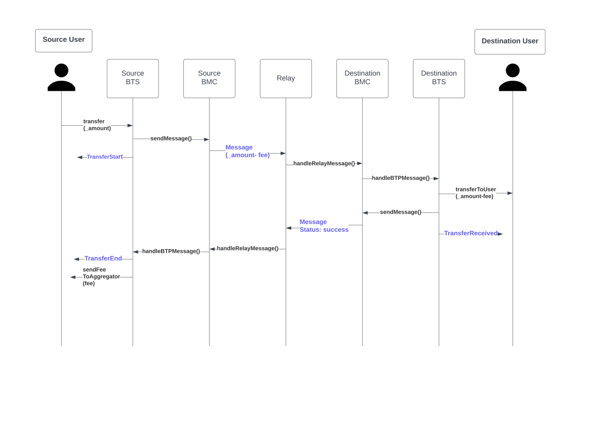

# Token Transfer Flow 

A general token transfer operation involves 3 transactions on chain. 2 on source and 1 on destination. The message sent by source chain is picked up by relay and forwarded to destination chain. Similarly, the event generated by destination is picked up by the relay and forwarded to source chain. The flow for token transfer is based on all the methods called and eventlog generated is as follows: 

* ###  Prerequisties
    
    For icon to bsc
    - IRC2 : Transfer IRC2 to BTS Contract
    - IRC2Tradeable: Approve amount to BTS Contract
    
    For bsc to icon
    - ERC20: Approve amount to BTS Core Contract

* ### Source chain
    - For nativecoin transfer, transfer nativecoin to BTS using transferNativeCoin method.
    - For tokens, call transfer method on BTS Contract.
    - Transfer requires BTP Address of destination reciever, amount and coinName.
    - Both these methods check for transfer restrictions (token limit and blacklist)
    - Then, TransferTransactionObject and TransferRequestObject is created.
    - Amount to transfer cross chain is locked on source chain.
    - Deduct fee required for transfer.
    - Serial Number (sn) is updated by 1.
    - TransferRequest object is encoded and send to BTP Message Center (BMC)
    - TransferTransaction is saved to the BTS contract itself mapped to sn.
    - BMC picks up encoded TransferRequest, and adds header fields and emits `Message` event.
    - BTS Contract emits TransferStart event to represent Token Transfer has been initiated on source chain.

* ### Relay
    - Relay picks up the Message event generated by source BMC and calls handleRelayMessage on the BMC Contract on destination chain.

* ### Destination Chain
    - BMC Contract decodes the message cuts off header, and transfer BTS Message to BTS Contract on destination.
    - BTS Contract checks for service type in the message. If the service type is "Request Token Transfer", the BTS contract mints/transfers that token to the address of the reciever.
    - Blacklist and token limit are checked as well.
    - If tokens are successfully transferred, it sends successful response message to the destination BMC, which in turn emits a `Message` event to be picked up by the relayer.
    - TransferReceived eventlog is generated if token operation on destination chain was successful.
    - If token transfer is not successful, it emits Message event with unsuccessful response code.

* ### Relay
    - Relay picks up Message event generated by destination BMC and calls handleRelayMessage on the BMC contract on the source chain.

* ### Source Chain
    - BMC Contract calls handleBTPMessage on the source BTS Contract.
    - The message generated on destination chain has a code, which represents if token transfer was successful. It is checked on the BTS contract.
    - If token transfer was successful, the amount is deducted from locked amount and TransferEnd event is emitted.
    - If token transfer was not successful, the amount - fee is set to refundable amount and tries to refund back to the user and TransferEnd event is emitted.
    - The TransferTransaction data saved for that sn will be reset to null.

